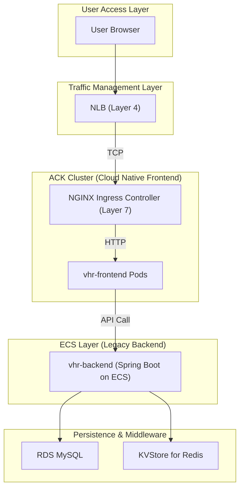

# vhr Project Infrastructure Diagram (Frontend Cloud Native Phase)

## Cloud Infrastructure Components

### Component Summary by Environment

| Component | Type | dev | test | staging | perf | prod |
|-----------|------|-----|------|---------|------|------|
| **VPC** | alicloud_vpc | vhr-dev (10.0.0.0/16) | vhr-test (10.4.0.0/16) | vhr-staging (10.8.0.0/16) | vhr-perf (10.12.0.0/16) | vhr-prod (10.16.0.0/16) |
| **Frontend VSwitch** | alicloud_vswitch | 10.0.1.0/24 | 10.4.1.0/24 | 10.8.1.0/24 | 10.12.1.0/24 | 10.16.1.0/24 |
| **Backend VSwitch** | alicloud_vswitch | 10.0.2.0/24 | 10.4.2.0/24 | 10.8.2.0/24 | 10.12.2.0/24 | 10.16.2.0/24 |
| **Database VSwitch** | alicloud_vswitch | 10.0.3.0/24 | 10.4.3.0/24 | 10.8.3.0/24 | 10.12.3.0/24 | 10.16.3.0/24 |
| **Web Security Group** | alicloud_security_group | vhr-dev-web-sg | vhr-test-web-sg | vhr-staging-web-sg | vhr-perf-web-sg | vhr-prod-web-sg |
| **Backend Security Group** | alicloud_security_group | vhr-dev-backend-sg | vhr-test-backend-sg | vhr-staging-backend-sg | vhr-perf-backend-sg | vhr-prod-backend-sg |
| **DB Security Group** | alicloud_security_group | vhr-dev-db-sg | vhr-test-db-sg | vhr-staging-db-sg | vhr-perf-db-sg | vhr-prod-db-sg |
| **Frontend ACK Nodes** | alicloud_instance | 1 × ecs.c6.large | 2 × ecs.c6.medium | 3 × ecs.c6.large | 3 × ecs.c6.xlarge | 3 × ecs.c6.2xlarge |
| **Backend ECS** | alicloud_instance | 1 × ecs.c6.large | 1 × ecs.c6.medium | 2 × ecs.c6.large | 2 × ecs.c6.xlarge | 4 × ecs.c6.2xlarge |
| **MySQL RDS** | alicloud_db_instance | rds.mysql.c6.large (20GB) | rds.mysql.s1.small (10GB) | rds.mysql.s2.medium (50GB) | rds.mysql.s3.large (100GB) | rds.mysql.s4.large (200GB) |
| **Redis KVStore** | alicloud_kvstore_instance | Redis (10GB) | Redis (10GB) | Redis (50GB) | Redis (100GB) | Redis (200GB) |
| **OSS Bucket** | alicloud_oss_bucket | dev-vhr-app-storage | test-vhr-app-storage | staging-vhr-app-storage | perf-vhr-app-storage | prod-vhr-app-storage |
| **Load Balancer (NLB)** | alicloud_nlb_load_balancer | Pay-as-you-go (TCP) | Pay-as-you-go (TCP) | Pay-as-you-go (TCP/TLS) | Pay-as-you-go (TCP) | Pay-as-you-go (TCP/TLS) |
| **Container Registry (ACR)** | alicloud_cr_namespace | vhr (shared) | vhr (shared) | vhr (shared) | vhr (shared) | vhr (shared) |
| **Frontend Image Repo** | alicloud_cr_repo | vhr/frontend | vhr/frontend | vhr/frontend | vhr/frontend | vhr/frontend |
| **Kubernetes Cluster** | alicloud_cs_managed_kubernetes | vhr-dev (Frontend Only) | vhr-test | vhr-staging | vhr-perf | vhr-prod (DR) |

### Current State: Hybrid Architecture

In this phase, we have completed the **Frontend Migration** to ACK, while the **Backend Services** continue to run on legacy ECS instances.

## Backend Migration Effort Analysis

Migrating the backend from ECS to ACK is a separate phase. Below is an estimation of the effort required:

| Task Category | Description | Effort Level | Key Activities |
|---------------|-------------|--------------|----------------|
| **Containerization** | Dockerizing the Spring Boot application | Low | Write Dockerfile, multi-stage build optimization. |
| **Service Discovery** | Transitioning from IP-based to DNS-based discovery | Medium | Replace ECS IPs with K8s Service names (e.g., `vhr-backend-svc`). |
| **Configuration** | Moving settings to Kubernetes | Medium | Migrate environment variables and file-based configs to ConfigMaps/Secrets. |
| **Network & Security** | Updating Security Groups & Whitelists | Low | Update RDS/Redis white lists to include Pod CIDR (10.99.0.0/16). |
| **CI/CD Pipeline** | Updating deployment workflows | Medium | Update Harness pipelines to use Helm for backend deployment. |
| **Observability** | Integrating with Prometheus/Logtail | Low | Add annotations for metrics scraping and configure log paths. |

### Summary of Effort
*   **Total Estimated Time**: 3-5 days for a single environment.
*   **Complexity**: Medium (due to state management and service-to-service communication).
*   **Risk**: Low, as it can be done service-by-service using a hybrid approach (current state).

## Load Balancer (Best Practices)

Current implementation uses **NLB (Network Load Balancer)** as the entry point. 

1.  **Layer 4 (NLB)**: Handles massive concurrent TCP connections.
2.  **Layer 7 (Ingress)**: Handles SSL termination, Host-based routing, and Path-based routing for the **Frontend**.
3.  **Future Proof**: When the backend is migrated, the same Ingress Controller can route `/api` traffic to backend Pods without changing the NLB configuration.
