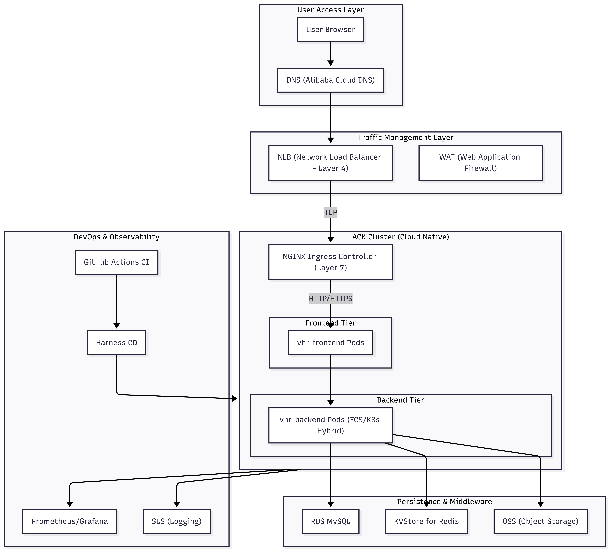

# vhr Project Infrastructure Diagram



## Cloud Infrastructure Components

### Component Summary by Environment

| Component | Type | dev | test | staging | perf | prod |
|-----------|------|-----|------|---------|------|------|
| **VPC** | alicloud_vpc | vhr-dev (10.0.0.0/16) | vhr-test (10.4.0.0/16) | vhr-staging (10.8.0.0/16) | vhr-perf (10.12.0.0/16) | vhr-prod (10.16.0.0/16) |
| **Frontend VSwitch** | alicloud_vswitch | 10.0.1.0/24 | 10.4.1.0/24 | 10.8.1.0/24 | 10.12.1.0/24 | 10.16.1.0/24 |
| **Backend VSwitch** | alicloud_vswitch | 10.0.2.0/24 | 10.4.2.0/24 | 10.8.2.0/24 | 10.12.2.0/24 | 10.16.2.0/24 |
| **Database VSwitch** | alicloud_vswitch | 10.0.3.0/24 | 10.4.3.0/24 | 10.8.3.0/24 | 10.12.3.0/24 | 10.16.3.0/24 |
| **Web Security Group** | alicloud_security_group | vhr-dev-web-sg | vhr-test-web-sg | vhr-staging-web-sg | vhr-perf-web-sg | vhr-prod-web-sg |
| **Backend Security Group** | alicloud_security_group | vhr-dev-backend-sg | vhr-test-backend-sg | vhr-staging-backend-sg | vhr-perf-backend-sg | vhr-prod-backend-sg |
| **DB Security Group** | alicloud_security_group | vhr-dev-db-sg | vhr-test-db-sg | vhr-staging-db-sg | vhr-perf-db-sg | vhr-prod-db-sg |
| **Frontend ECS** | alicloud_instance | 1 × ecs.c6.large | 1 × ecs.c6.medium | 1 × ecs.c6.medium | 2 × ecs.c6.xlarge | 2 × ecs.c6.2xlarge |
| **Backend ECS** | alicloud_instance | 1 × ecs.c6.large | 1 × ecs.c6.medium | 2 × ecs.c6.large | 2 × ecs.c6.xlarge | 4 × ecs.c6.2xlarge |
| **MySQL RDS** | alicloud_db_instance | rds.mysql.c6.large (20GB) | rds.mysql.s1.small (10GB) | rds.mysql.s2.medium (50GB) | rds.mysql.s3.large (100GB) | rds.mysql.s4.large (200GB) |
| **Redis KVStore** | alicloud_kvstore_instance | Redis (10GB) | Redis (10GB) | Redis (50GB) | Redis (100GB) | Redis (200GB) |
| **OSS Bucket** | alicloud_oss_bucket | dev-vhr-app-storage | test-vhr-app-storage | staging-vhr-app-storage | perf-vhr-app-storage | prod-vhr-app-storage |
| **Terraform State** | OSS Backend | vhr-terraform-state-dev | vhr-terraform-state-test | vhr-terraform-state-staging | vhr-terraform-state-perf | vhr-terraform-state-prod |

### Component Details

| Category | Component | Description | Terraform Resource |
|----------|-----------|-------------|-------------------|
| **Network** | VPC | Virtual Private Cloud for isolated network | `alicloud_vpc` |
| | VSwitch | Subnets for frontend, backend, and database tiers | `alicloud_vswitch` |
| | Security Group | Firewall rules for traffic control | `alicloud_security_group` |
| | Security Group Rule | Ingress/egress rules | `alicloud_security_group_rule` |
| **Compute** | ECS Instance | Elastic Compute Service (virtual machines) | `alicloud_instance` |
| **Database** | RDS MySQL | Managed MySQL database service | `alicloud_db_instance` |
| | DB Account | Database user account | `alicloud_db_account` |
| | DB Database | Logical database | `alicloud_db_database` |
| **Cache** | KVStore Redis | Managed Redis instance | `alicloud_kvstore_instance` |
| **Storage** | OSS Bucket | Object Storage Service | `alicloud_oss_bucket` |
| | OSS Bucket ACL | Access control configuration | `alicloud_oss_bucket_acl` |

### Security Group Rules

| Environment | Rule Name | Port | Source | Description |
|-------------|-----------|------|--------|-------------|
| dev | allow_backend_to_db | 3306 | 10.0.2.0/24 | MySQL access from backend |
| test | allow_backend_to_db | 3306, 5672, 6379 | 10.4.2.0/24 | MySQL, RabbitMQ, Redis from backend |
| staging | allow_backend_to_db | 3306, 6379 | 10.8.2.0/24 | MySQL, Redis from backend |
| perf | allow_backend_to_db | 3306, 6379 | 10.12.2.0/24 | MySQL, Redis from backend |
| prod | allow_backend_to_db | 3306, 6379 | 10.16.2.0/24 | MySQL, Redis from backend |

```mermaid
---
config:
  layout: dagre
---
flowchart LR
 subgraph subGraph0["User Layer"]
        B("CDN/Load Balancer")
        A["User Browser/Client"]
  end
 subgraph subGraph1["Network Layer"]
        C{"Web Application Firewall/API Gateway"}
        D["Nginx Reverse Proxy/API Gateway"]
  end
 subgraph subGraph2["Application Layer (vhr-web & mailserver)"]
    direction LR
        E("Spring Boot Application Cluster")
        F{"Cache: Redis"}
        G{"Message Queue: RabbitMQ"}
        H{"File Storage: FastDFS/OSS"}
  end
 subgraph subGraph3["Data Layer"]
        I["Database: MySQL/RDS"]
  end
 subgraph subGraph4["Monitoring & Logging"]
        J["Logging Service: ELK/SLS"]
        K["Monitoring Service: Prometheus/Grafana/ARMS"]
  end
 subgraph subGraph5["Security & Compliance"]
        M("CI/CD Pipeline")
        L["Policy as Code: OPA/Harness Policy"]
  end
 subgraph subGraph6["CI/CD (GitHub Actions & Harness)"]
        N("Code Repository: Git")
        O("GitHub Actions CI")
        P("Harness CD")
  end
    A -- HTTPS/HTTP --> B
    B --> C
    C --> D
    D --> E
    E --> F & G & H & I & J & K
    L --> M
    M --> N
    N --> O
    O --> P
    P --> E & I & F & G & H

     B:::boundary
     A:::actor
     C:::boundary
     D:::boundary
     E:::system
     F:::service
     G:::service
     H:::service
     I:::database
     J:::tool
     K:::tool
     M:::tool
     L:::tool
     N:::tool
     O:::tool
     P:::tool
    classDef default fill:#fff,stroke:#333,stroke-width:2px,color:#000
    classDef actor fill:#ADD8E6,stroke:#336699,stroke-width:2px,color:#000
    classDef boundary fill:#F0FFF0,stroke:#3CB371,stroke-width:2px,color:#000
    classDef system fill:#F8F8FF,stroke:#6A5ACD,stroke-width:2px,color:#000
    classDef database fill:#FFE4B5,stroke:#FF8C00,stroke-width:2px,color:#000
    classDef service fill:#E6E6FA,stroke:#8A2BE2,stroke-width:2px,color:#000
    classDef tool fill:#F5DEB3,stroke:#DAA520,stroke-width:2px,color:#000