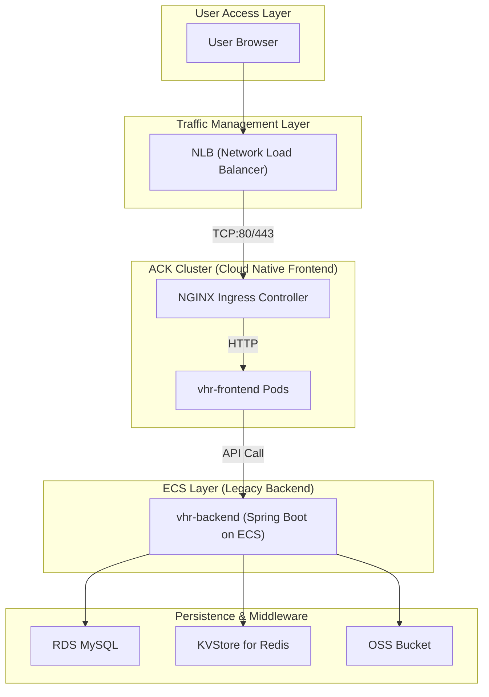

# vhr Project Infrastructure Diagram (Cloud Native Phase)

## Cloud Infrastructure Components

### Component Summary by Environment

| Component | Type | dev | test | staging | perf | prod |
|-----------|------|-----|------|---------|------|------|
| **VPC** | alicloud_vpc | vhr-dev (10.0.0.0/16) | vhr-test (10.4.0.0/16) | vhr-staging (10.8.0.0/16) | vhr-perf (10.12.0.0/16) | vhr-prod (10.16.0.0/16) |
| **Frontend VSwitch** | alicloud_vswitch | 10.0.1.0/24 | 10.4.1.0/24 | 10.8.1.0/24 | 10.12.1.0/24 | 10.16.1.0/24 |
| **Backend VSwitch** | alicloud_vswitch | 10.0.2.0/24 | 10.4.2.0/24 | 10.8.2.0/24 | 10.12.2.0/24 | 10.16.2.0/24 |
| **Database VSwitch** | alicloud_vswitch | 10.0.3.0/24 | 10.4.3.0/24 | 10.8.3.0/24 | 10.12.3.0/24 | 10.16.3.0/24 |
| **DR VSwitch** | alicloud_vswitch | N/A | N/A | N/A | N/A | 10.16.4.0/24 (Zone B) |
| **Web Security Group** | alicloud_security_group | vhr-dev-web-sg | vhr-test-web-sg | vhr-staging-web-sg | vhr-perf-web-sg | vhr-prod-web-sg |
| **Backend Security Group** | alicloud_security_group | vhr-dev-backend-sg | vhr-test-backend-sg | vhr-staging-backend-sg | vhr-perf-backend-sg | vhr-prod-backend-sg |
| **DB Security Group** | alicloud_security_group | vhr-dev-db-sg | vhr-test-db-sg | vhr-staging-db-sg | vhr-perf-db-sg | vhr-prod-db-sg |
| **Kubernetes (ACK)** | alicloud_cs_managed_kubernetes | vhr-dev-primary | vhr-test-primary | vhr-staging-primary | vhr-perf-primary | vhr-prod-primary & secondary |
| **Backend ECS** | alicloud_instance | 1 × ecs.c6.large | 1 × ecs.c6.medium | 2 × ecs.c6.large | 2 × ecs.c6.xlarge | 4 × ecs.c6.2xlarge |
| **MySQL RDS** | alicloud_db_instance | rds.mysql.c6.large (20GB) | rds.mysql.s1.small (10GB) | rds.mysql.s2.medium (50GB) | rds.mysql.s3.large (100GB) | rds.mysql.s4.large (200GB) |
| **Redis KVStore** | alicloud_kvstore_instance | Redis (10GB) | Redis (10GB) | Redis (50GB) | Redis (100GB) | Redis (200GB) |
| **OSS Bucket** | alicloud_oss_bucket | dev-vhr-app-storage | test-vhr-app-storage | staging-vhr-app-storage | perf-vhr-app-storage | prod-vhr-app-storage |
| **Load Balancer (NLB)** | alicloud_nlb_load_balancer | Internet (TCP) | Internet (TCP) | Internet (TCP/TLS) | Internet (TCP) | Internet (TCP/TLS) |
| **Container Registry (ACR)** | alicloud_cr_namespace | vhr (shared) | vhr (shared) | vhr (shared) | vhr (shared) | vhr (shared) |

### Current Architecture: Cloud Native Frontend + Legacy Backend

In this phase, we have completed the **Frontend Migration** to ACK across all environments. The **Backend Services** continue to run on legacy ECS instances until the next migration phase.

## Key Infrastructure Decisions

1.  **NLB as Entry Point**: We use **Network Load Balancer (NLB)** for all environments to handle high concurrency. It forwards traffic to the Ingress Controller running on ACK worker nodes.
2.  **ACK for Frontend**: All frontend components are containerized and managed by Alibaba Cloud Container Service for Kubernetes (ACK).
3.  **Hybrid Connectivity**: Frontend Pods communicate with Backend ECS instances via internal VPC network. Security groups are configured to allow traffic from Pod CIDR (10.99.0.0/16) to RDS and Redis.
4.  **Disaster Recovery**: Production environment features a same-city dual-cluster setup (Zone A primary, Zone B secondary) with real-time data replication.
5.  **ACR Integration**: A centralized Container Registry (ACR) is used across all environments to manage Docker images.

## Environment-Specific Configurations

| Environment | ACK Version | Node Type | Autoscaling | Load Balancer |
|-------------|-------------|-----------|-------------|---------------|
| **dev** | 1.24 | ecs.c6.large | 1-3 nodes | NLB (TCP) |
| **test** | 1.24 | ecs.c6.large | 2-5 nodes | NLB (TCP) |
| **staging** | 1.24 | ecs.c6.large | 2-5 nodes | NLB (TCP/TLS) |
| **perf** | 1.24 | ecs.c6.xlarge | 3-10 nodes | NLB (TCP) |
| **prod** | 1.24 | ecs.c6.2xlarge | 3-10 nodes | NLB (TCP/TLS) |
